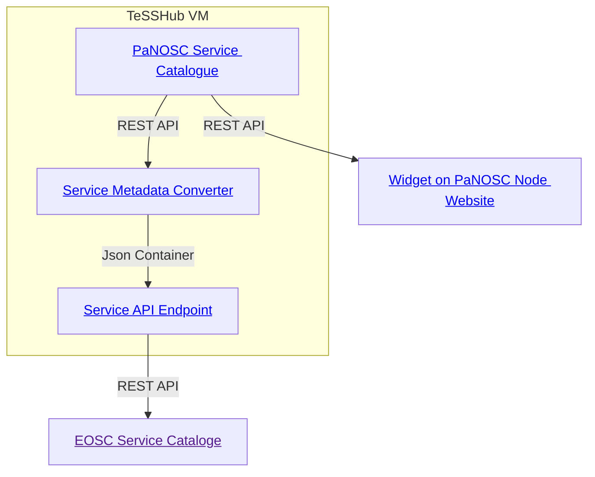

# EOSC Service Catalogue Converter

Service metadata stored in PaN-Training can be made available to the EOSC using the [eosc-services-catalog](https://github.com/pan-training/eosc-services-catalog). This program takes a json file containing the service metadata and serves it in an EOSC compliant way. This repository is concerned with generating this json file from metadata in PaN-Training.

## How to execute

Install dependencies

```bash
python3 -m venv venv
source venv/bin/activate
pip install -r requirements.txt 
```

run script

```bash
python main.py
```

get information about configuration options

```bash
python main.py --help
```
## Example Architecture used for the EOSC Node PaNOSC

For the [EOSC node PaNOSC](https://eosc.panosc.eu), service metadata is collected in the [PaNOSC Service Catalogue](https://services.tesshub.hzdr.de/collections/eosc-panosc-node-services), processed by a cron job executing the EOSC Service Catalogue Converter (this repository), which makes the service metadata available via the [eosc-services-catalog](https://github.com/pan-training/eosc-services-catalog) in the [PaNOSC REST API endpoint](https://pan-training.eu/service-catalogue/api/v3/docs).


